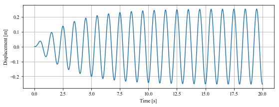

# DSR
A Dynamic Structural Response solver based on Julia

基于Julia语言的结构动力响应求解器

## Simple Usage

For a classic Single-Degree-of-Freedom system under resonant harmonic load, the equation of motion is


By using DSR, the response can be solved as follows. 

```julia
using DSR

T, zta = 1.0, 0.05
omg = 2.0*pi/T
t1, dt = 40, 0.005
s = SDF(omg, zta)
p = (t) -> sin(2.0*π/T*t)
r = response(s,p,t1,dt)
```

With the help of PyPlot, the resonant response can be drawn:

```julia
using PyPlot

figure("Resonant Response",(12,4))
plot(r[:,1], r[:,2])
grid(true)
xlabel("Time [s]")
ylabel("Displacement [m]")
show()
```

