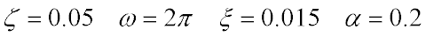

# DSR
A Julia Package for solving Dynamic Structural Response

求解结构动力响应的 Julia 包


## Install

```julia
Pkg.clone("git://github.com/Panchatantra/DSR.jl.git")
```

To plot response curves, it is recommended to install PyPlot.

## Simple Example

For a classic Single-Degree-of-Freedom system under resonant harmonic base excitation, the equation of motion is


Normalized


Consider a SDF system whose natural period is 1s and damping ratio is 5%, the response (time interval is 0.005s, total response duriation is 20s) can be solved via DSR. 

```julia
using DSR

T, zta = 1.0, 0.05
omg = 2.0*pi/T
t1, dt = 20.0, 0.005
s = SDF(omg, zta)
p = (t) -> sin(2.0*π/T*t)
r = response(s,p,t1,dt)
```

With the help of PyPlot, the resonant response can be drawn:

```julia
using PyPlot

figure("Resonant Response",(12,4))
plot(r[:,1], r[:,2])
grid(true)
xlabel("Time [s]")
ylabel("Displacement [m]")
show()
```


## Complex Example

A SDF system with Nonlinear Viscous Damper.

Equation


Normalized


System parameters



```julia
using DSR

T, zta = 1.0, 0.05
omg = 2.0*pi/T
xi, alpha = 0.015, 0.2
s = SDF_VD(omg, zta, xi, alpha)

a_g = readtxt("EQ-S-1.txt")
dt = 0.005
nstep = 9000
r  = response(s,  a_g, dt, dt, nstep)
```

